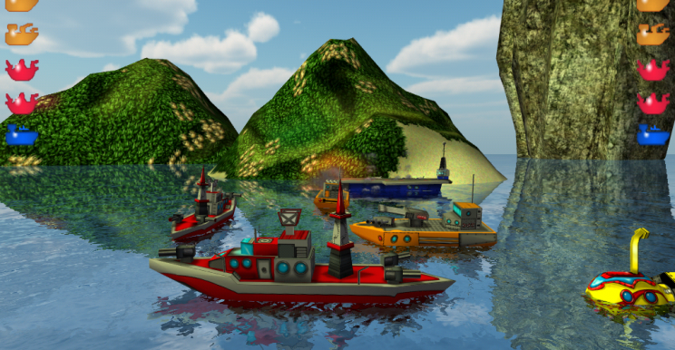
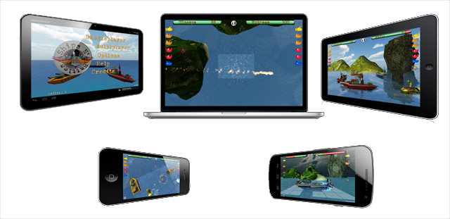
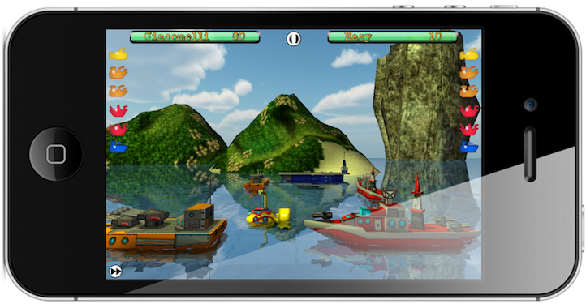

Play the next generation of the classic game, controlling the most destructive power of the seas with a finger touch.

## Available on
* iOS: [https://itunes.apple.com/us/app/ships-n-battles-hd/id510480132?mt=8](https://itunes.apple.com/us/app/ships-n-battles-hd/id510480132?mt=8)

* MacOS: [https://itunes.apple.com/pt/app/ships-n-battles/id531527189?mt=12](https://itunes.apple.com/pt/app/ships-n-battles/id531527189?mt=12)

* Android: [https://play.google.com/store/apps/details?id=com.skahal.shipsnbattles](https://play.google.com/store/apps/details?id=com.skahal.shipsnbattles)

## What people say about it?
>"There's been a few attempts at making battleship games for the platform, as you'd expect. None are as good as Ships N’ Battles." 
MATT SAINSBURY, DIGITALLY DOWNLOADED

> "Ships N' Battles is a battleships game for iOS and Mac with impressive 3D graphics and updated gameplay." 
CONNOR JONES, APP-SCORE

> "Ships N' Battles is a gorgeous looking game." 
MARTIN BAKER, GOD IS A GEEK

## Easy to learn, hard to mastery
Ships N' Battles is a easy game to learn, but with all the bonus combinations and strategy, you'll need to learn to use the tools to succeed and crash your enemies (especially that friend of yours that keep winning).

<iframe width="560" height="420" src="http://www.youtube.com/embed/8qVJPZkMaRc?color=white&theme=light"></iframe>

## Multiplayer
Bored to always beat the machine? Brings your friends to the battle field! Ships N' Battles offer a multiplayer mode via Game Center, bluetooth, Lan e Global Server! Who will be the king of the seas? With Global Server technology, Ships N' Battles allows you to play multiplayer cross-platform. In other words, you have a iPhone and do you want to play against your friend that has a Android?

No problem, just connect by Global Server!

## Bonuses
With 10 different bonuses, Ships N’ Battles is a more dynamic game then others. Compare your rating in the World Ranking leaderboard and show who is the king of the seas. Earn trophies, more than 30 achivements to unlock!

And there's more:

* 4 types of ships
* 10 different bonuses
* 4 levels of difficulty
* Multiplayer via Global Server (play against others iOS, Mac and Android)
* Multiplayer via bluetooth
* Multiplayer via LAN (wifi)
* Accelerated mode in the single player

_[press-kit](/press/kit/snb/index.html)_